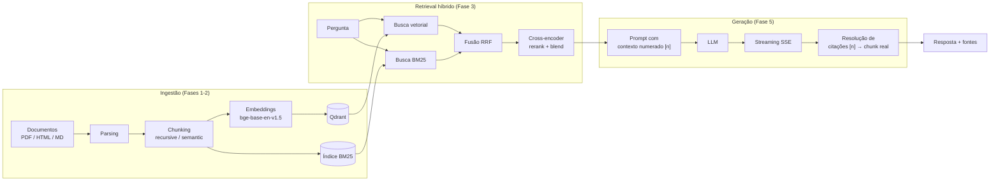
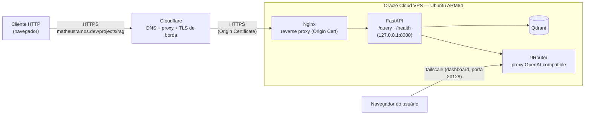

# RAG-Based Knowledge Assistant

Assistente de conhecimento interno baseado em RAG (Retrieval-Augmented Generation), com retrieval híbrido (vetorial + keyword), reranking, geração com citação de fontes e deploy em produção — cada etapa validada com execução real (dados sintéticos, mas pipeline e infra reais) e avaliada com métricas, não só "rodou sem erro".

**Demo ao vivo**: [https://matheusramos.dev/projects/rag/](https://matheusramos.dev/projects/rag/) — pergunte algo sobre a base de documentos sintéticos (documentação de API + política interna de uma empresa fictícia) e veja o retrieval e a geração acontecendo em tempo real. HTTPS via domínio próprio (Cloudflare + Nginx), limite de 8 perguntas/minuto por visitante.

## Status

Projeto completo: Fases 1-7 implementadas e validadas com execução real.

| Fase | Conteúdo |
|---|---|
| 1 | Parsing (PDF/HTML/Markdown) + chunking (recursive/semantic) |
| 2 | Indexação de embeddings no Qdrant + índice BM25 |
| 3 | Retrieval híbrido (RRF) + reranking (cross-encoder) |
| 4 | Avaliação comparativa de retrieval (Precision@5, Recall@5, MRR) |
| 5 | API FastAPI (streaming SSE) + geração via LLM + citações + Answer Faithfulness (RAGAS) |
| 6 | Deploy em VPS via Docker Compose, 9Router (proxy de LLM) rodando na própria VPS |
| 7 | Este README — diagrama de arquitetura, resultados consolidados, trade-offs |

## Arquitetura

**Pipeline (ingestão → retrieval → geração):**



**Deploy (Fase 6 + domínio próprio):**



O LLM de geração roda dentro da própria VPS, num container `router` (imagem `decolua/9router`, multi-arquitetura `amd64`/`arm64`) no mesmo `docker-compose.yml` — `api` fala com ele pela rede interna do Docker (`http://router:20128/v1`), sem depender de nenhuma outra máquina no ar. O dashboard de administração (configurar providers/combo) fica exposto só na tailnet Tailscale da VPS, nunca na internet pública. Na frente, o tráfego público chega via Cloudflare (DNS proxied + TLS na borda) até o Nginx da VPS, que termina TLS com um Origin Certificate e repassa pra API, que só escuta em `127.0.0.1:8000` — não é mais alcançável diretamente pela internet (ver [Trade-offs](#trade-offs-e-decisões-de-design)).

## Stack

- **Orquestração**: LlamaIndex
- **Vector DB**: Qdrant (Docker)
- **Embeddings**: BAAI/bge-base-en-v1.5 (local)
- **Reranker**: BAAI/bge-reranker-base (local, cross-encoder)
- **API**: FastAPI (streaming via SSE) + frontend estático de demonstração (`app/static/index.html`, servido pela própria API) + rate limiting em memória no `/query`
- **LLM de geração e juiz de avaliação**: configurável — Anthropic (API oficial) ou qualquer proxy OpenAI-compatible (`LLM_PROVIDER=openai_compatible`), usado em produção via 9Router rodando como container na própria VPS
- **Deploy**: Docker Compose numa VPS (Oracle Cloud), código versionado no GitHub; dashboard de administração do 9Router exposto só via Tailscale
- **Borda/HTTPS**: domínio próprio (`matheusramos.dev`, Cloudflare) com DNS proxied, SSL/TLS em modo Full (strict) e Nginx na VPS terminando TLS com um Cloudflare Origin Certificate

## Estrutura do projeto

```
app/
  parsing/      # extração de texto de PDF/HTML/Markdown (Fase 1)
  chunking/     # recursive e semantic chunking (Fase 1)
  indexing/     # embeddings + upsert no Qdrant (Fase 2)
  retrieval/    # hybrid search (RRF) + reranking (Fase 3)
  evaluation/   # métricas de retrieval (Fase 4) + Answer Faithfulness via RAGAS (Fase 5)
  generation/   # prompt + cliente LLM (streaming) + citações (Fase 5)
  api/          # endpoints FastAPI: /query (streaming) e /health (Fase 5) + rate limiting
  config/       # settings via variáveis de ambiente
  static/       # frontend estático da demo ao vivo (index.html, servido pela própria API)
data/
  test_docs/    # documentos sintéticos para validar o pipeline
  eval/         # dataset de perguntas + ground truth (Fase 4)
docker/
  docker-compose.yml  # Qdrant + 9Router + API (Fases 5-6)
  Dockerfile          # imagem da API (Fase 5)
scripts/
  run_ingestion.py       # valida parsing + chunking ponta a ponta (Fase 1)
  run_indexing.py        # parse -> chunk -> embed -> upsert no Qdrant + BM25 (Fase 2)
  run_query.py            # consulta com hybrid retrieval + reranking (Fase 3)
  run_evaluation.py       # compara os 4 modos de retrieval (Fase 4)
  run_api.py              # sobe a API FastAPI (Fase 5)
  run_generation_eval.py  # Answer Faithfulness via RAGAS (Fase 5)
  generate_test_pdf.py   # gera o PDF de teste sintético
tests/          # testes unitários (unittest, sem dependência de pytest)
```

A configuração do Nginx (reverse proxy TLS) vive no host da VPS, fora do repositório — é infraestrutura da borda, não do código da aplicação.

## Setup

```bash
python3 -m venv .venv
source .venv/bin/activate
pip install -r requirements.txt
cp .env.example .env
```

Sobe o Qdrant para desenvolvimento local:

```bash
docker compose -f docker/docker-compose.yml up -d qdrant
```

## Rodando a Fase 1 (parsing + chunking)

```bash
python scripts/run_ingestion.py --dir data/test_docs --strategy both
```

Compara as duas estratégias de chunking com um chunk_size menor, pra ver a diferença de comportamento (recursive corta no meio de seções grandes, semantic respeita os headings):

```bash
python scripts/run_ingestion.py --dir data/test_docs --strategy both --chunk-size 60 --overlap 10
```

## Rodando a Fase 2 (indexação no Qdrant)

Smoke test sem nenhuma dependência pesada instalada (usa embedder e vector store falsos — só valida a orquestração):

```bash
python scripts/run_indexing.py --dir data/test_docs --dry-run
```

Indexação de verdade (precisa do venv com `pip install -r requirements.txt` e do Qdrant no ar via `docker compose -f docker/docker-compose.yml up -d qdrant`):

```bash
python scripts/run_indexing.py --dir data/test_docs
```

Na primeira execução, o `sentence-transformers` baixa o modelo `BAAI/bge-base-en-v1.5` (~400MB) do Hugging Face — pode demorar alguns minutos.

## Rodando a Fase 3 (hybrid retrieval + reranking)

Reindexe primeiro para gerar o índice BM25 (o `run_indexing.py` da Fase 2 já constrói e salva em `data/bm25_index.pkl` por padrão):

```bash
python scripts/run_indexing.py --dir data/test_docs
```

Smoke test sem dependências pesadas:

```bash
python scripts/run_query.py --dry-run
```

Consulta de verdade, comparando os modos (a mesma comparação da Fase 4 de avaliação):

```bash
python scripts/run_query.py --query "Qual o rate limit da API?" --mode vector_only
python scripts/run_query.py --query "Qual o rate limit da API?" --mode hybrid
python scripts/run_query.py --query "Qual o rate limit da API?" --mode hybrid_rerank
python scripts/run_query.py --query "Qual o rate limit da API?" --mode hybrid_rerank_blend
```

**`hybrid_rerank_blend`** é uma mitigação descoberta na Fase 4: o cross-encoder puro (`hybrid_rerank`) às vezes derruba uma passagem correta porque julga o *tema geral* do trecho, não o fato específico nele (ver `app/retrieval/blend.py` pro caso concreto que motivou isso). Em vez de deixar o rerank_score sobrescrever 100% o ranking, esse modo combina (normalizado) o rerank_score com o rrf_score original — o consenso do retrieval híbrido funciona como uma rede de segurança. `rerank_blend_alpha` (default 0.7) controla o peso: 1.0 = igual a `hybrid_rerank`, 0.0 = ignora o cross-encoder.

## Rodando a Fase 4 (avaliação de retrieval)

Smoke test sem dependências pesadas:

```bash
python scripts/run_evaluation.py --dry-run
```

Avaliação de verdade (precisa do Qdrant indexado + BM25 salvo — rode `run_indexing.py` primeiro):

```bash
python scripts/run_evaluation.py
```

Compara `vector_only`, `hybrid`, `hybrid_rerank` e `hybrid_rerank_blend` em Precision@5, Recall@5 e MRR sobre as 26 perguntas em `data/eval/qa_dataset.json` (19 com 1 chunk relevante, 7 multi-hop com 2-4 chunks relevantes).

## Rodando a Fase 5 (API + geração via LLM)

A geração aceita dois providers, via `LLM_PROVIDER` no `.env`:

- `LLM_PROVIDER=anthropic` — API oficial da Anthropic (`ANTHROPIC_API_KEY`).
- `LLM_PROVIDER=openai_compatible` — qualquer proxy que fale o protocolo de chat completions da OpenAI (`LLM_BASE_URL`, `LLM_API_KEY`, `LLM_MODEL`). Usado em produção com o [9Router](https://github.com/decolua/9router) rodando como container na própria VPS, evitando acoplar o projeto a um único provider pago (ver [Trade-offs](#trade-offs-e-decisões-de-design)).

Sobe a API (precisa do Qdrant indexado + BM25 salvo, como na Fase 3/4):

```bash
python scripts/run_api.py --reload
```

No boot, a API carrega os modelos locais (embedder + reranker) uma única vez — pode demorar alguns segundos.

Testa o endpoint `/query`, que responde via Server-Sent Events (streaming) e citação de fontes no payload final:

```bash
curl -N -X POST http://localhost:8000/query \
    -H 'Content-Type: application/json' \
    -d '{"question": "Como funciona a autenticação da API?"}'
```

Cada afirmação da resposta é citada como `[n]`, resolvido de volta pros metadados reais do chunk (`source`/`section`/`page`) no evento `done` — sem confiar no LLM para relatar a fonte corretamente (ver `app/generation/citations.py`). Uma falha do LLM no meio do streaming emite um evento `error` explícito em vez de derrubar a conexão sem explicação.

`GET /health` reporta se o índice BM25 foi carregado (hybrid retrieval disponível) e qual collection do Qdrant está em uso.

### Answer Faithfulness via RAGAS

Diferente da Fase 4 (avalia só retrieval), esta métrica avalia se a resposta *gerada* é fiel ao contexto recuperado — detecta alucinação, via decomposição em afirmações atômicas + julgamento NLI por um LLM juiz. Tem custo real por pergunta (1 chamada pra gerar a resposta + 1+ do juiz), por isso `--limit` controla quantas perguntas rodar:

```bash
python scripts/run_generation_eval.py --dry-run          # valida a orquestração, sem custo de API
python scripts/run_generation_eval.py --limit 5           # roda de verdade nas 5 primeiras perguntas
```

O juiz do RAGAS usa o mesmo provider configurado pra geração (`build_evaluator_llm`, via `LangchainLLMWrapper`).

## Resultados

### Retrieval (Fase 4) — k=5, n=26

| modo | precision@5 | recall@5 | MRR |
|---|---|---|---|
| vector_only | 0.254 | 0.968 | 0.859 |
| hybrid | 0.254 | 0.968 | 0.897 |
| hybrid_rerank | 0.254 | 0.958 | 0.904 |
| **hybrid_rerank_blend** | **0.262** | **0.978** | **0.904** |

`--verbose` revelou uma regressão de recall pontual em `hybrid_rerank` (uma pergunta multi-hop perdeu um chunk relevante porque o cross-encoder julgou o tema geral do trecho, não o fato específico nele). `hybrid_rerank_blend` corrigiu a regressão sem sacrificar o ganho de MRR do reranking puro, além de melhorar precision@5 e recall@5 agregados — é o modo default do projeto (`app/retrieval/pipeline.py` e `app/api/dependencies.py`).

### Answer Faithfulness (Fase 5) — RAGAS

| Rodada | n | Faithfulness médio |
|---|---|---|
| Piloto, prompt com bug de meta-atribuição | 5 | 0.889 |
| Após correção do prompt (mesmas perguntas do outlier) | 3 | 1.000 |
| Completa, prompt corrigido | 26 | **0.950** |

Duas investigações de outlier durante a validação, com metodologias e conclusões opostas:

**Outlier real (0.60 → corrigido).** A resposta terminava com uma frase de meta-atribuição ("Essas informações constam na documentação... seção X [1]"), que descreve *onde* está a informação em vez do conteúdo em si — o chunk não se autodescreve, então o juiz não conseguiu confirmar essa frase como fundamentada. Corrigido proibindo esse padrão no `SYSTEM_PROMPT`; a mesma pergunta voltou a pontuar 1.00.

**Outlier falso (0.23 → ruído do juiz, não bug).** Inspeção manual da resposta e do contexto completo (sem truncar) mostrou fundamentação correta nos chunks citados. Re-rodando a *mesma* pergunta, com o mesmo prompt e contexto, o score saiu 0.69 na segunda tentativa — evidência de que o modelo usado como juiz (via 9Router, menor que o GPT-4/Claude grande que os papers do RAGAS normalmente usam como referência) introduz ruído real na decomposição de afirmações + julgamento NLI. A média agregada continua um sinal útil e estável (0.889 em n=5, 0.950 em n=26); scores de perguntas individuais isoladas, não — documentado como limitação conhecida em vez de "corrigido" (trocar de juiz reintroduziria a dependência de crédito pago que motivou usar o 9Router).

## Deploy (Fase 6)

Deploy validado numa VPS Oracle Cloud (Ubuntu 24.04, ARM64) via Docker Compose, com o código vindo do GitHub (`git clone`, não cópia manual de arquivos).

```bash
git clone <repo> && cd rag-knowledge-assistant
cp .env.example .env   # editar: LLM_PROVIDER, LLM_BASE_URL, LLM_API_KEY, LLM_MODEL
sudo docker compose -f docker/docker-compose.yml --env-file .env up -d --build
sudo docker compose -f docker/docker-compose.yml --env-file .env exec api python scripts/run_indexing.py --dir data/test_docs
```

`docker-compose.yml` sobe três serviços: `qdrant`, `router` (9Router) e `api` (build a partir de `docker/Dockerfile`). O diretório `data/` é bind-mounted em vez de copiado pra imagem, porque a indexação roda depois do build, contra o Qdrant do próprio compose. **Atenção**: a API carrega o índice BM25 uma única vez, no startup (`app.state.generator`) — se a indexação rodar depois da API já estar de pé, é preciso `docker compose restart api` pra ela pegar o índice novo.

**Primeira versão**: o LLM rodava fora da VPS, num proxy local (9Router) no Mac do usuário, alcançado via Tailscale (`tailscale serve --bg --tcp=20128 tcp://127.0.0.1:20128`). Funcionou, mas acoplava a disponibilidade da API em produção a uma máquina de uso pessoal estar ligada e com o app aberto — inaceitável mesmo pra portfolio, então foi substituído.

**Versão final**: o 9Router roda como um terceiro serviço (`router`) no mesmo `docker-compose.yml`, imagem oficial `decolua/9router` (multi-arquitetura, compatível com o ARM64 da VPS). A `api` fala com ele pela rede interna do Docker (`LLM_BASE_URL=http://router:20128/v1`) — zero dependência externa. O dashboard de administração (porta 20128, onde se configuram providers e o combo do 9Router) é publicado só no IP Tailscale da própria VPS (`ports: ["<ip-tailscale-da-vps>:20128:20128"]` no compose), nunca em `0.0.0.0` — Docker manipula iptables diretamente e pode ignorar regras do `ufw`, então amarrar a porta a um IP específico é a forma confiável de mantê-la fora da internet pública. Login remoto (não-`localhost`) exige trocar a senha padrão do 9Router antes; contornado com uma senha inicial via `INITIAL_PASSWORD` (variável de ambiente lida do `.env`, não versionada), trocada no primeiro acesso pelo dashboard.

Validado ponta a ponta, inclusive pelo IP público (depois de liberar a porta 8000 no `ufw` e na Security List da VCN do Oracle Cloud): retrieval híbrido, streaming SSE completo, geração via 9Router local à VPS, resposta em português citando `[n]`, citação resolvida corretamente.

### Domínio próprio + HTTPS (Cloudflare + Nginx)

A demo ao vivo inicialmente rodava só no IP público da VPS, sem TLS. Depois de registrar um domínio próprio (`matheusramos.dev`, Cloudflare), a demo passou a rodar em `https://rag.matheusramos.dev/`:

- **DNS**: registro A `rag.matheusramos.dev → <IP da VPS>`, com proxy da Cloudflare ativado (nuvem laranja) — esconde o IP de origem e termina TLS na borda gratuitamente.
- **SSL/TLS mode**: **Full (strict)** — exige certificado válido também na origem, não só na borda.
- **Origin Certificate**: gerado gratuitamente em Cloudflare (SSL/TLS → Origin Server, validade de 15 anos), instalado no Nginx da VPS — não depende de Let's Encrypt/certbot nem de renovação automática.
- **Nginx como reverse proxy** na VPS: termina TLS com o Origin Certificate e repassa pra API em `127.0.0.1:8000`, com diretivas específicas pra não quebrar o streaming SSE (`proxy_buffering off`, `proxy_cache off`, `chunked_transfer_encoding off`, `proxy_read_timeout` alto).
- **Porta 8000 fechada ao público**: o mesmo problema do bind em `0.0.0.0` que afetava o dashboard do 9Router (Docker ignora `ufw`) também valia pra API — corrigido amarrando o `docker-compose.yml` a `127.0.0.1:8000:8000`, e as regras `ufw` pra 8000 (que nunca protegiam de verdade) foram removidas.

Validado com execução real: `/health` e um `/query` completo com streaming funcionando via HTTPS no domínio; a porta 8000 do IP direto passou a recusar conexão.

### Migração de subdomínio para path (`/projects/rag/`)

A demo passou de `rag.matheusramos.dev` para `matheusramos.dev/projects/rag/`, pra ficar dentro do portfólio principal em vez de um subdomínio separado:

- **Nginx**: o site `matheusramos.dev` ganhou uma `location /projects/rag/` que faz proxy pra mesma API (`127.0.0.1:8000`), com a barra final tanto na location quanto no `proxy_pass` — isso remove o prefixo `/projects/rag/` antes de repassar pro backend, que continua vendo `/`, `/query`, `/health` normalmente.
- **Frontend**: o `fetch('/query', ...)` virou `fetch('query', ...)` (caminho relativo) — assim funciona tanto na raiz quanto atrás de um prefixo, sem precisar a API saber em qual path está montada.
- **CSP**: o `<style>`/`<script>` inline viraram `style.css`/`app.js` externos, pra respeitar a Content-Security-Policy estrita (`script-src 'self'`) do domínio principal, que bloquearia script/style inline.
- **Identidade visual**: a paleta escura original deu lugar à mesma paleta neutra (off-white/quase-preto) e tipografia do portfólio, com um link de volta pro site principal.
- `rag.matheusramos.dev` continua existindo só como redirecionamento 301 pro novo caminho, preservando links antigos.

## Testes

```bash
python3 -m unittest discover -s tests -v
```

69 testes, cobrindo parsing, chunking, indexação, retrieval, geração, citações, rate limiting e a API (incluindo o tratamento de erro do streaming).

## Trade-offs e decisões de design

**Chunking sem tokenizer exato.** O contador de tokens (`app/chunking/token_utils.py`) usa regex em vez de tiktoken/BPE. `chunk_size` é um parâmetro heurístico — não existe contagem "exata" que sirva pra todo embedding model (bge-base usa WordPiece, não o BPE da OpenAI) — e um contador sem dependência externa evita acoplar o chunking a uma biblioteca específica. Pra contagem exata do tokenizer do embedding model, trocar por `AutoTokenizer.from_pretrained(EMBEDDING_MODEL)`.

**`hybrid_rerank_blend` como default, não `hybrid_rerank` puro.** Cross-encoder isolado é mais suscetível a julgar o tema geral do trecho em vez do fato específico citado na pergunta — um problema real observado nos dados de avaliação (Fase 4), não hipotético. Misturar o rerank_score com o rrf_score original custa uma fração do ganho de MRR do reranking puro-metade do caminho (MRR idêntico: 0.904 nos dois), mas recupera a regressão de recall — trade-off favorável sem contrapartida negativa identificada no dataset atual.

**Provider de LLM desacoplado (Anthropic vs. proxy OpenAI-compatible).** Escolhido para não travar o projeto (nem a demonstração em portfolio) a uma única conta paga, e porque é um padrão real de produção — times trocam de provider ou usam um roteador/gateway interno. O custo é um juiz de RAGAS mais ruidoso quando o modelo por trás do proxy é menor que os modelos de referência dos papers do RAGAS (documentado nos resultados acima) — aceito porque a métrica agregada continua confiável e o ganho de flexibilidade/portfolio supera o ruído em scores individuais.

**Só streaming, sem endpoint não-SSE.** O plano original pedia streaming explicitamente, e o valor de diferenciação do projeto está no retrieval (retrieval híbrido + blend + avaliação comparativa), não em oferecer múltiplas variantes de API pro mesmo LLM.

**Citação resolvida por índice, nunca por texto do LLM.** `app/generation/citations.py` extrai só o marcador numérico `[n]` da resposta e resolve pro metadado real do chunk que ocupava a posição n no prompt — o LLM nunca é a fonte de verdade sobre *qual* é a fonte, só sobre *que* informação usar. Evita um LLM confiante citando a fonte errada (alucinação de citação, distinta de alucinação de conteúdo).

**Proxy de LLM dentro da VPS, não num LLM local nem preso ao notebook do usuário.** Três alternativas descartadas: (a) rodar o LLM de geração localmente na própria VPS — inviável no free tier ARM da Oracle (sem GPU, RAM limitada); o build do Docker já levou ~90 minutos só pra instalar `torch`/`transformers`/`sentence-transformers` do embedder e reranker, que são leves comparados a servir um LLM; (b) usar a API paga da Anthropic na VPS — reintroduz a dependência de crédito que motivou trocar pra um proxy local; (c) manter o 9Router no Mac do usuário e a VPS alcançando via Tailscale — funcionou, mas acopla a disponibilidade da API de produção a uma máquina pessoal estar ligada, um ponto único de falha inaceitável mesmo pra portfolio. Solução final: 9Router como container no próprio `docker-compose.yml` da VPS, com o dashboard de administração exposto só via Tailscale (nunca publicamente) — resolve o SPOF sem abrir mão da superfície de ataque mínima que motivou usar Tailscale desde o início.

**Cloudflare Origin Certificate em vez de Let's Encrypt/certbot.** Um certificado emitido pela própria Cloudflare (válido só entre Cloudflare e a origem, nunca verificado diretamente por um navegador) evita manter um processo de renovação automática (certbot + cron/systemd timer) na VPS pra um cenário onde o navegador nunca fala direto com a origem mesmo — o modo "Full (strict)" da Cloudflare já garante que a conexão de borda até a origem é criptografada e autenticada. Custo: confiar a Cloudflare como intermediário de TLS (ela decripta e recriptografa o tráfego na borda) — trade-off aceitável pra um projeto de portfolio, mas relevante de mencionar numa entrevista técnica.

## Ambiente de desenvolvimento

Desenvolvido num Mac Intel (Python 3.12 — `python` costuma apontar pro Python 3.9 do Xcode em macOS, usar sempre `python3`; `torch>=2.2.0,<3.0.0`). Deploy numa VPS ARM64 — o mesmo `requirements.txt` funciona nas duas arquiteturas, mas o build de dependências pesadas (torch/transformers) é sensivelmente mais lento em ARM sem wheels pré-compiladas.
